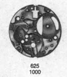

# caliberscan

A tool that leverages OpenCV and OCR to scan any watch movement manual to get a detailed breakdown of its individual components and part numbers.

To explore:
- Creating SVGs from the images
- Straightening of photocopies images
- Formatting of part no.; depending on manufacturer
- Languages; usually given in French, English and German

### Sample Output
#### Movement: Omega Caliber 625
| Part no. | Description | Image |
| -------- | ----------- | ----- |
| 625.1000 | Plate       | |